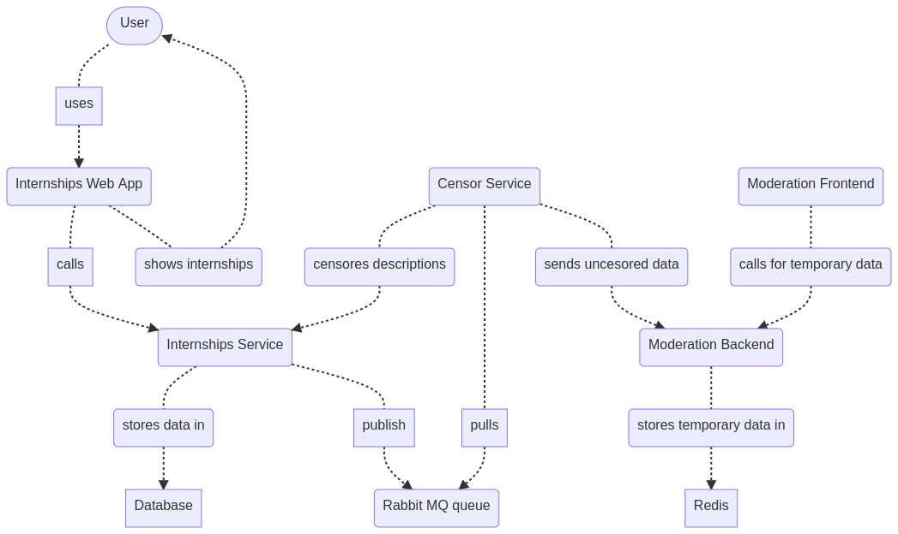

# students-internships

## Table of contents
 - [Description](#description)
 - [Dev Setup](#dev-setup)
 - [Running the application locally](#running-the-application-locally)
   * [Running docker containers](#running-docker-containers)
   * [Run App](#run-app)
   * [Run Interface](#run-interface)
   * [Linting](#linting)
   * [Database operations](#database-operations)
 - [Components](#components)
   * [Components Diagram](#component-diagram) 
 - [Integration Patterns](#integration-patterns)
   * [Message Patterns](#message-patterns)
   * [Endpoint Patterns](#endpoint-patterns)
   * [Routing Patterns](#routing-patterns)
   * [Channel Patterns](#channel-patterns)

# Description

The system consists of 5 docker containers running small microservices:

1. Interface -> a web application for students internships
2. Students-internships -> a fastapi server serving the web application
3. DB -> a postgresql database
4. Censor -> a censoring script that takes descriptions from students details and removes profanity
5. RabbitMQ -> a rabbitmq queue that is used in the censoring process
6. ModerationBackend -> a moderation server serving the moderation interface
7. Redis -> a redis DB for moderation of data
8. ModerationFrontend -> a moderation interface to view all profanity descriptions

A diagram of the above description can be found in the [system context diagram](#system-context-diagram) 

# Dev Setup

Before installing any Python packages it would be better to create a virtual environment for the app. Best to use pyenv.
See here: https://akrabat.com/creating-virtual-environments-with-pyenv/

Python version used: `3.8.5`

Run the following command to install necessary packages:

`make setup`

When installing new Python packages make sure to freeze it:

`make freeze-requirements`
(Be sure that you are in the virtual env for the project and not add unnecessary packages)

#Running the application locally

## Running docker containers

`make wakeup-database` -> creates the db

`make build` -> builds all containers

`make compose-interface` -> runs the web app

`make compose-service` -> runs the fastapi server

`make compose-rabbit` -> runs the queue

`make compose-censor` -> runs the censoring script

`make compose-redis` -> runs the redis db

## Run App

`make run`
 
 If you want to change the port or host you can specify them like this:
 
 `make run HOST="127.0.0.5" port=8081`

## Run interface

`make run-interface`

## Linting

Linting the whole project:

`make lint`

Linting the backend:

`make lint-backend`

Linting the frontend:

`make lint-frontend`

## Database operations

We are using a postgresql database called _students_internships_db_. Make sure to create it before running the migration.

To create all tables:
`make migrate`

To create a new revision:
`make revision MESSAGE=desired_message`

# Components

## Component Diagram

## Sequence Diagram

This diagram present the entire flow of adding a profanity description in the user profile

## System Context Diagram

# Integration Patterns

## Message Patterns:

   * Request-reply: For all the REST endpoints
   * Command message: Messages sent via the `Students-Descriptions` rabbitMQ queue. Sending the uncensored data to the 
     `censor-worker` to be censored where it's processed

## Endpoint patterns

   * Asynchronous consumer: the `censor-worker` is a long-running job that continuously consumes messages
   * Data translation: the message format is different from the internal data model 
   
## Routing patterns

   * Message Broker: RabbitMQ

## Channel patterns
   
   * Message channel: "Students-Descriptions"
